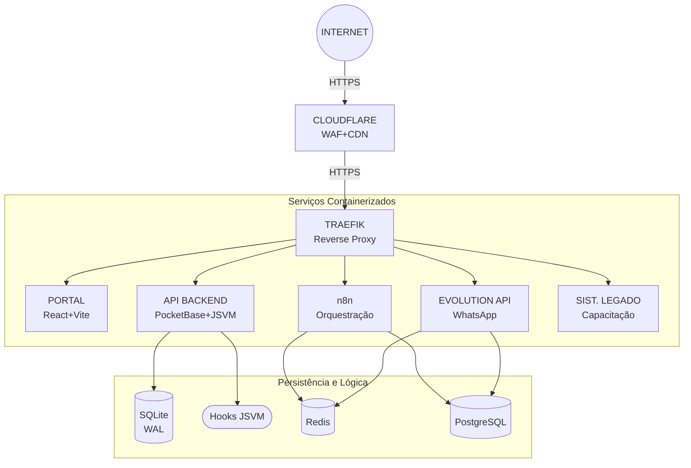
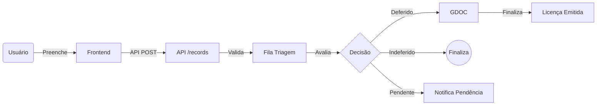
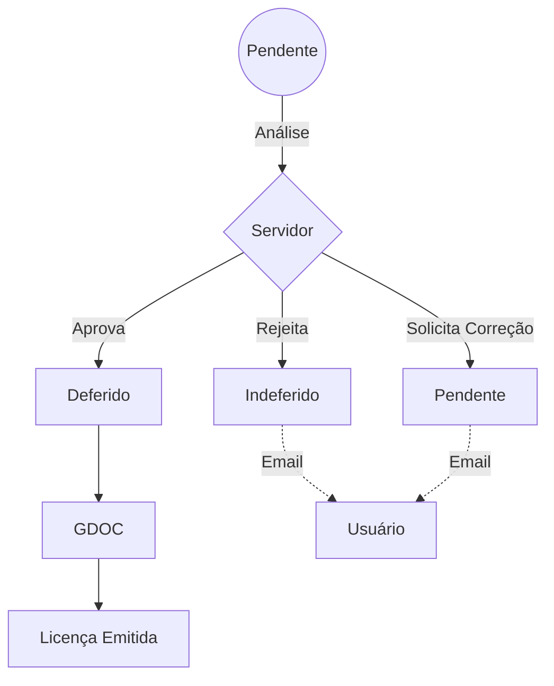
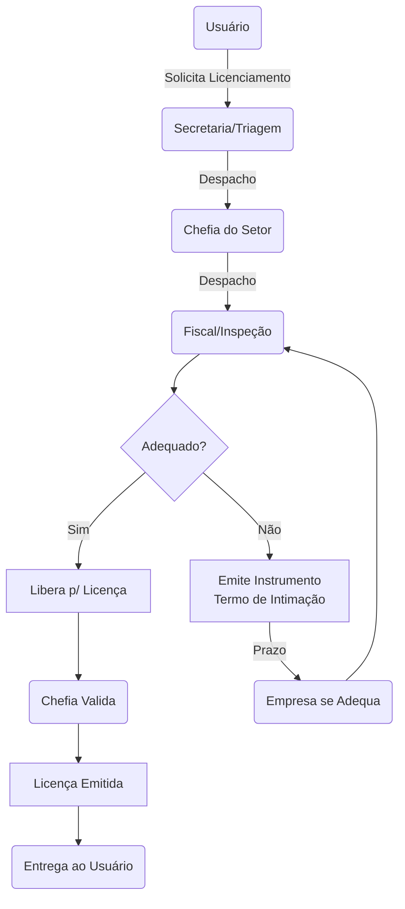

# 📄 Relatório Técnico: Sistema de Gestão da Vigilância Sanitária (DEVISA/CVISA)

**Departamento de Vigilância Sanitária - DEVISA/CVISA/SESMA**
**Prefeitura Municipal de Belém**

**Data:** 08 de Janeiro de 2026 | **Versão:** 1.0

---

## 📋 Sumário

Este documento apresenta a arquitetura do **Sistema de Gestão de Processos da Vigilância Sanitária de Belém**, visando subsidiar a **solicitação de infraestrutura dedicada (VPS)** à CINBESA, considerando:
- Volume atual de operações
- Projeção de crescimento > **20 mil usuários**
- Plano de escalabilidade para migração de sistemas terceiros

---

**Índice de Tópicos:**
1. [Visão Geral](#1--visão-geral)
2. [Arquitetura](#2-️-arquitetura)
3. [Fluxos de Processos](#3--fluxos-de-processos)
4. [Regras de Negócio](#4--regras-de-negócio)
5. [Integrações Externas](#5--integrações-externas)
6. [Infraestrutura Atual](#6-️-infraestrutura-atual)
7. [Projeção de Crescimento](#7--projeção-de-crescimento)
8. [Anexos Técnicos](#8--anexos-técnicos)

---

## 1. 🎯 Visão Geral

### 1.1 Objetivo
Automatizar o ciclo completo de licenciamento sanitário, desde a entrada do requerimento até a emissão da licença certificada, sob regime de **segurança em camadas**.

### 1.2 Público-Alvo
- **Externos:** Estabelecimentos comerciais, responsáveis técnicos, contadores e cidadãos
- **Internos:** Gestão e servidores das divisões DVSA, DVSDM, DVSCEP, DVSE, VISAMB e Casa do Açaí

### 1.3 Estrutura de Rotas
| Serviço | Função | Rota |
| :--- | :--- | :--- |
| Portal de Processos | Interface principal | `/` |
| API Backend | PocketBase + Banco | `/api` |
| Realtime | Conexões SSE | `/api/realtime` |
| Sistema Alimentos | Sistema legado | `/alimentos` |

---

## 2. 🏗️ Arquitetura

### 2.1 Diagrama


#### 2.1.1 Diagrama Detalhado (ASCII)
```
INTERNET → CLOUDFLARE (WAF+CDN) → TRAEFIK (Reverse Proxy)
                                        │
           ┌────────────────────────────┼────────────────────────────┐
           ▼                            ▼                            ▼
    ┌─────────────┐            ┌─────────────────┐           ┌─────────────┐
    │   PORTAL    │            │   API BACKEND   │           │     n8n     │
    │  Principal  │            │ Backend + Auth  │           │  Automação  │
    │ React+Vite  │            │ PocketBase+JSVM │           │  Webhooks   │
    └─────────────┘            │ Nginx+SQLite    │           │ Redis/PgSQL │
           │                   └────────┬────────┘           └─────────────┘
           ▼                            │
    ┌─────────────┐            ┌────────┴────────┐
    │ SIST.LEGADO │            ▼                 ▼
    │ Capacitação │      SQLite (WAL)        Hooks
    └─────────────┘      (Persistência)    (Imagem)
```

### 2.2 Componentes
| Componente | Tecnologia | Função |
| :--- | :--- | :--- |
| **Portal Principal** | *React* 19, *Vite*, *TypeScript* | Interface principal |
| **Sistema Legado** | *React*, *Vite*, *TailwindCSS* | Sistema de capacitação |
| **API Backend** | *PocketBase* (Go), SQLite (WAL) | API REST, Auth, Banco e Realtime |
| **Hooks de Integração** | 25 hooks nativos (imutáveis) | Validação e gatilhos |
| **Middleware** | Gatekeeper (JSVM) | Proteção ReDoS |
| **Automação** | *n8n* (container isolado) | E-mails e messageria |
| **Persistência** | *Redis* + *PostgreSQL* | Filas e auditoria |

### 2.3 Lógica de Servidor (Smart Engine)
O backend estende sua capacidade nativa através de **Hooks JSVM** (Engine V8 isolada):

- **Rotas Customizadas:** Endpoints públicos (`/api/public/*`) para validação de CPFs e emissão de certificados.
- **Triggers de Banco:** Disparam e-mails transacionais e invalidam registros obsoletos automaticamente.
- **Cron Jobs:** Manutenção automática (limpeza de logs) e sincronização de caches analíticos.
- **Realtime:** Monitoramento de conexões ativas (SSE) para gestão de presença de usuários.

### 2.4 Defesa em Camadas
1. **Borda (*Cloudflare*):** WAF, proteção DDoS, mascaramento de IP, rate limiting por rota
2. **Orquestração (*Traefik*):** SSL/TLS, roteamento interno e headers de segurança
3. **Aplicação (API Rules):** Regras granulares por coleção/método
4. **Validação (JSVM Hooks):** Sanitização de payloads e proteção ReDoS

### 2.5 Controle de Acesso (API Rules)
Regras de acesso por coleção (expressões booleanas em runtime):

| Operação | Exemplo |
| :--- | :--- |
| **List/Search** | `@request.auth.role = "auth"` |
| **View** | `@request.auth.id != ""` |
| **Create** | `@request.auth.role ~ "admin\|manager"` |
| **Update** | `@request.auth.id = created_by.id` |
| **Delete** | `@request.auth.role = "admin"` |

Suporte a campos relacionais: `@request.auth.sector = sector.id`

**File Tokens:** Arquivos protegidos exigem token de curta duração (gerado via API) para download.

### 2.6 Rate Limiting
Proteção em múltiplas camadas contra abusos e ataques:

**Camada 1 - Borda (Cloudflare WAF):**
| Rota | Limite | Objetivo |
| :--- | :--- | :--- |
| Webhooks (`/api/public/webhook/*`) | 10 req/min | Prevenir inundação de payloads externos |
| API Pública (`/api/public/*`) | 100 req/min | Limitar consultas anônimas |

**Camada 2 - Gateway (Nginx):**
| Rota | Limite | Objetivo |
| :--- | :--- | :--- |
| API Geral (`/api/*`) | 30 req/s (burst 50) | Proteger o backend de picos |
| Autenticação (`/api/*/auth*`) | 5 req/s (burst 10) | Anti-brute-force em login |

**Camada 3 - Aplicação (PocketBase):**
- Rate limiting nativo para tentativas de login
- Bloqueio temporário após falhas consecutivas

### 2.7 Otimização do Banco de Dados
**Índices:** Campos usados para busca e filtro indexados.

**Views Materializadas:** Agregações pré-calculadas para dashboards:
| View | Função |
| :--- | :--- |
| `analytics_*` | Métricas por período (processos, receita, produtividade) |
| `cache_zip` | Distribuição geográfica de estabelecimentos |
| `cache_cnaes` | Contagem por atividade econômica |

**Cron Jobs:** Rotinas agendadas nativas e customizadas:
| Job | Expressão | Função |
| :--- | :--- | :--- |
| `DBOptimize` | `0 0 * * *` | VACUUM/otimização diária |
| `LogsCleanup` | `0 */6 * * *` | Limpeza de logs a cada 6h |
| `CacheUpdate` | Customizado | Atualização de views/caches |

---

## 3. 🔄 Fluxos de Processos

### 3.1 Entrada via Portal


**Etapas:**
1. Usuário preenche formulário e anexa documentos
2. Pré-validação na interface + API Rules + hooks de integridade
3. Solicitação entra na fila de triagem da divisão
4. Servidor avalia: **Deferido**, **Indeferido** ou **Pendente**
5. Se deferido, cria processo no GDOC e finaliza a solicitação
6. Se indeferido, finaliza a solicitação
7. Se pendente, manda para a fila de pendentes
8. Usuário é notificado por e-mail

### 3.2 Entrada via Webhooks (Formulários Externos)
Rotas `/api/public/webhook/*` recebem payloads externos processados por:
1. **Validação de Autenticidade:** Tokens nos headers
2. **Sanitização:** Remoção de dados redundantes
3. **Gatekeeper:** Proteção ReDoS
4. **Extração de Metadados:** Mapeamento dinâmico

### 3.3 Sistema de Comunicação

#### 3.3.1 Atual: E-mail como Canal Principal
Sem autenticação pública, e-mail é o canal principal:

| Momento | Gatilho | Conteúdo |
| :--- | :--- | :--- |
| **Solicitação** | `onRecordAfterCreate` | Confirmação + protocolo |
| **Triagem** | `onRecordAfterUpdate` | Status (Deferido/Indeferido/Pendente) |
| **Licença** | `onRecordAfterCreate` | PDF anexo + QR Code |

#### 3.3.2 Futuro: E-mail como Canal Auxiliar
Com autenticação pública:

| Aspecto | Atual | Futuro |
| :--- | :--- | :--- |
| **Canal Principal** | E-mail | Conta do usuário |
| **Canal Secundário** | - | E-mail + WhatsApp |
| **Status** | Via e-mail | Dashboard + SSE |
| **Licença** | Anexo | Área do usuário |

Automação: n8n (atual) → *WhatsApp Business API* (futuro)

### 3.4 Emissão de DAM

#### 3.4.1 Gargalo Atual
A emissão de DAM Avulso no SIAT exige:
- Autenticação em `http://siat.belem.pa.gov.br/`
- Preenchimento manual de **16 campos** (JSF/PrimeFaces)
- Aguardar renderização AJAX entre campos interdependentes
- Registrar número do DAM no sistema DEVISA/CVISA

**Métricas:**
- **Tempo médio:** 6-8 min/DAM (pior caso)
- **Volume (2025):** 8.000+ solicitações
- **Impacto:** ~933 horas/ano em tarefa passível de automação

#### 3.4.2 Problema: Duplicidade de DAMs
Empresas podem pagar até 3x o valor devido quando:
1. Emitem DAM via REGIN
2. Trocam de contador
3. Novo contador solicita novo DAM à DEVISA/CVISA

Não há verificação automatizada de DAM existente no exercício.

---

## 4. 📜 Regras de Negócio

### 4.1 Classificação por CNAE
| Divisão | Sigla | Escopo | CNAEs |
| :--- | :--- | :--- | :--- |
| Alimentos | DVSA/GALE | Restaurantes, mercados, açaiterias | ~100 |
| Drogas e Medicamentos | DVSDM/GVDM | Farmácias, distribuidoras | ~50 |
| Saúde | DVSCEP/GVSS | Hospitais, clínicas, estética | ~100 |
| Estabelecimentos | DVSE/GALE | Escolas, hotéis, lavanderias | ~76 |
| Casa do Açaí | Açaí | Batedores artesanais | Específico |
| Vigilância Ambiental | VISAMB | Água para consumo humano | N/A |

### 4.2 Tipos de Processos
**Licenciamento:** Primeira Licença e Renovação

**Diversos (25 tipos):** 2ª via, autenticação de livro, parecer de evento, aprovação de projeto, relatório AFE, desinterdição, inutilização, encerramento, etc.

**Taxas (DAM):** De quase todos os tipos de processos existentes

### 4.3 Isenções
MEI, Órgão Público e Serviço de Utilidade Pública são isentos de taxa, mas não são isentos de fiscalização.

### 4.4 Documentos Obrigatórios
Lista dinâmica conforme: tipo de processo, natureza jurídica, categoria de atividade e se primeira licença ou renovação.

### 4.5 Workflow de Triagem


> **Cada transição de status dispara e-mail automático ao solicitante**, garantindo transparência durante todo o ciclo do processo.

---

## 5. 🔗 Integrações Externas

| Sistema | Função | Integração |
| :--- | :--- | :--- |
| **GDOC** (gdoc.dominioprefeitura) | Gestão de processos | Manual |
| **SIAT** (siat.dominioprefeitura) | Emissão de DAMs | Manual (JSF) |
| **Certifica** (dentro do Portal do Servidor) | Assinatura digital | Manual |

**Sobre o SIAT:** Desenvolvido por terceirizada. Banco de dados pertence à SEFIN. Responsabilidade técnica da CINBESA. Solicitações de integração devem ser direcionadas à CINBESA.

### 5.1 Proposta: Integração para DAM

Para consulta/validação/prevenção de duplicidades, pode haver consumo de views. Para emissão (gravação), pode-se integrar via REST, SOAP, stored procedures, troca de arquivos... conforme disponibilidade da CINBESA.

#### 5.1.1 Requisitos (Modelo REST)
| Método | Endpoint | Função |
| :--- | :--- | :--- |
| `POST` | `/api/v1/dam/avulso` | Emissão individual |
| `POST` | `/api/v1/dam/lote` | Emissão em lote |
| `GET` | `/api/v1/dam/{numero}` | Consulta DAM |
| `GET` | `/api/v1/dam/contribuinte/{cnpj}` | Histórico do contribuinte |

#### 5.1.2 Payload de Emissão (Exemplo)
```json
{
  "tipo_pessoa": "PJ",
  "cnpj": "19769575000100",
  "razao_social": "NOVA MEDICA COMÉRCIO LTDA",
  "unidade": "SESMA",
  "tributo": 509,
  "receita": 1614,
  "valor_principal": 984.94,
  "data_vencimento": 1770587283,
  "informacoes_adicionais": "Protocolo: 2E9yr9e. CNAE: 4645-1/01. Exercício 2026."
}
```

#### 5.1.3 Casos de Uso
1. **Emissão Avulsa:** Servidor seleciona contribuinte e taxa; sistema retorna DAM avulso instantaneamente
2. **Emissão em Lote:** Renovações automáticas para empresas com licença a vencer (exceto isentos)
3. **Prevenção de Duplicidade:** Consulta prévia ao contribuinte antes de emitir

**Economia estimada:** ~933 horas/ano

### 5.2 Proposta: View de Empresas Sujeitas à VISA

View no sistema fazendário filtrando empresas ativas em Belém com CNAE sujeito à Vigilância Sanitária.

> **Nota:** Estrutura baseada no layout público da Receita Federal. O esquema real pode diferir.

**Tabela: Empresas**
| Campo | Tipo | Descrição |
| :--- | :--- | :--- |
| `cnpj_basico` | VARCHAR(8) | Raiz do CNPJ |
| `razao_social` | VARCHAR(200) | Nome empresarial |
| `natureza_juridica` | VARCHAR(4) | Código |
| `porte_empresa` | VARCHAR(2) | ME, EPP, Demais |
| `opcao_mei` | BOOLEAN | Se optante MEI |
| `capital_social` | DECIMAL(15,2) | Capital declarado |

**Tabela: Estabelecimentos**
| Campo | Tipo | Descrição |
| :--- | :--- | :--- |
| `cnpj` | VARCHAR(14) | CNPJ completo |
| `situacao_cadastral` | VARCHAR(2) | 02=Ativa |
| `cnae_fiscal_principal` | VARCHAR(7) | CNAE principal |
| `cnae_fiscal_secundaria` | TEXT | CNAEs secundários |
| `bairro` | VARCHAR(100) | Bairro |
| `municipio` | VARCHAR(100) | Município |
| `uf` | CHAR(2) | UF |

**Tabela: DAMs Emitidos**
| Campo | Tipo | Descrição |
| :--- | :--- | :--- |
| `num_documento_dam` | VARCHAR(20) | PK |
| `codigo_barras` | VARCHAR(48) | Linha digitável |
| `valor_total` | DECIMAL(10,2) | Valor |
| `num_identificacao` | VARCHAR(20) | CNPJ/CPF |
| `situacao_pagamento` | VARCHAR(100) | Status ("0 - Emitido", "1 - Baixado") |
| `data_pagamento` | DATE | Data da baixa |

**Filtros:**
- `situacao_cadastral = '02'` (Ativa)
- `uf = 'PA'` e `municipio = 'BELEM'`
- CNAE principal ou secundário na lista VISA

**Benefícios:**
1. Emissão proativa antes do vencimento
2. Prevenção de DAMs duplicados
3. Identificação automática de isentos (MEIs)
4. Base sincronizada com Receita Federal

### 5.3 Plano de Internalização (Longo Prazo)

**Objetivo:** Centralizar todos os fluxos dentro do sistema, eliminando dependências externas.

| Atual | Futuro |
| :--- | :--- |
| Comunicação via e-mail | Notificações no sistema + e-mail auxiliar |
| Formulários externos e nativos | Processos agrupados por usuário |
| Emissão manual de DAM (SIAT) | Integração via Web Service |
| Despachos no GDOC | Tramitação interna com workflow |

**Módulos planejados:**
- **Autenticação Pública:** Conta do usuário para acompanhamento e histórico
- **Módulo Financeiro:** Integração SIAT para DAMs
- **Protocolo e Tramitação:** Substituição do GDOC (despachos internos)
- **Instrumentos Fiscais:** Emissão de termos (intimação, apreensão, etc.)
- **Verificação de Autenticidade:** Validação nativa via QR Code (já existente, carece de domínio oficial)

#### 5.3.1 Fluxo Futuro de Tramitação


**Benefícios:**
- Rastreabilidade completa de despachos
- Prazos controlados por workflow
- Instrumentos fiscais digitais
- Usuário acompanha status em tempo real

---

## 6. 🖥️ Infraestrutura Atual

### 6.1 VPS Atual
| Recurso | Especificação | Uso |
| :--- | :--- | :--- |
| SO | Ubuntu 24.04 LTS | - |
| RAM | 8 GB | ~35% |
| vCPUs | 3 Cores | Load: 0.47 |
| SSD (SATA) | 145 GB | 10% (14 GB) |
| Uptime | 125 dias | - |
| Produção | 05/01/2026 | 3 dias |

### 6.2 Consumo por Container
| Serviço | Memória | Função |
| :--- | :--- | :--- |
| *PocketBase* | 470.5 MB | API + Banco + Auth |
| Frontend | 5.8 MB | SPA estático |
| *n8n* | 600.0 MB | Orquestração |
| *Redis* | 9.7 MB | Filas |
| *PostgreSQL* | 100.4 MB | Banco de Dados (n8n + Evolution) |
| *Traefik* | 99.6 MB | Proxy reverso |
| *Easypanel* | 251.0 MB | Gerenciamento |

### 6.3 Volumes Persistentes
| Volume | Conteúdo |
| :--- | :--- |
| **Dados** | Banco SQLite + Anexos (uploads) |
| **Migrações** | Scripts de evolução do schema |

> Hooks de integração estão embarcados na imagem Docker (imutáveis em runtime).

### 6.4 Backup (Planejado)
- **Destino:** E2 Cloud Object Storage (S3)
- **Frequência:** Snapshots incrementais diários
- **Recuperação:** Restore nativo do PocketBase

---

## 7. 📈 Projeção de Crescimento

### 7.1 Base de Usuários
| Cenário | Usuários | Observação |
| :--- | :--- | :--- |
| Atual | ~100 | Servidores DEVISA/CVISA |
| Curto Prazo | 500-1.000 | RT e contadores |
| Médio Prazo | 5.000 | Área pública autenticada |
| Longo Prazo | **20.000** | Todos os estabelecimentos |

### 7.2 Funcionalidades Planejadas
| Recurso | Impacto |
| :--- | :--- |
| Autenticação externa | Conexões simultâneas |
| WhatsApp Business | Novo container + filas |
| Chatbot com IA | Processamento NLP |
| **Migração PostgreSQL** | Escala horizontal |

**Escalabilidade:**
- **Atual:** Vertical (Go + SQLite monolítico)
- **Futuro:** Horizontal (Elixir + PostgreSQL distribuído - ex. Supabase)

### 7.3 Proposta de Observabilidade (Sugestão)
O sistema conta com **logging nativo** de requisições e erros (armazenado internamente). Caso a infraestrutura de destino não possua monitoramento centralizado, adiciona-se nota de ferramenta complementar para:
- **Logs:** Externalização para maior segurança e retenção.
- **Uptime:** Monitoramento ativo da disponibilidade da API e integridade dos backups.
- **Alertas:** Notificação proativa da equipe técnica em caso de anomalias.

### 7.4 Recursos Necessários
| Cenário | RAM | vCPUs | SSD | Justificativa |
| :--- | :--- | :--- | :--- | :--- |
| Atual | 8 GB | 3 | 145 GB | Operação estável (~35% uso) |
| 1 ano | 8-16 GB | 4 | 200 GB | Autenticação pública + WhatsApp |
| 3 anos | 16 GB | 4-6 | 300 GB | 20k usuários + integrações |

> **Nota:** Projeções conservadoras. O PocketBase é extremamente eficiente; a carga atual não justifica mais de 16 GB mesmo com crescimento significativo.

---

## 8. 📎 Anexos Técnicos

### 8.1 Stack
**Frontend:** *React* 19, *Vite* 7, *TypeScript* 5.9, *TailwindCSS*, *Lucide*, *ECharts*, *React Hook Form*

**Backend:** *PocketBase* 0.28+ (Go), SQLite 3 (WAL), *Nginx*, *Supervisord*

**Automação:** *n8n* (auto-hospedado), *Redis*, *PostgreSQL*

**DevOps:** *Docker Swarm*, *Easypanel*, *Traefik*, *Cloudflare* (CDN+WAF)

### 8.2 Webhooks Ativos
| Rota | Método | Função |
| :--- | :--- | :--- |
| `/api/public/webhook/processos` | POST | Formulários de licenciamento |
| `/api/public/webhook/taxas` | POST | Solicitações de taxa |
| `/api/realtime` | GET (SSE) | Tempo real |

### 8.3 Coleções Principais
| Coleção | Registros | Função |
| :--- | :--- | :--- |
| `w_processos_visa` | Milhares | Solicitações via sistema |
| `w_processos_externos` | Milhares | Solicitações externas |
| `w_taxas_visa` | Milhares | Solicitações de taxa |
| `w_triagem_visa` | Milhares | Triagens |
| `w_licencas` | ~50.000+ | Licenças emitidas |
| `w_empresas` | ~100.000 | CNPJs Ativos de Belém - amostra de dez/25|
| `w_estabelecimentos` | ~100.000 | Estabelecimentos |

---

*Documento gerado em 08/01/2026. Sujeito a atualizações.*
